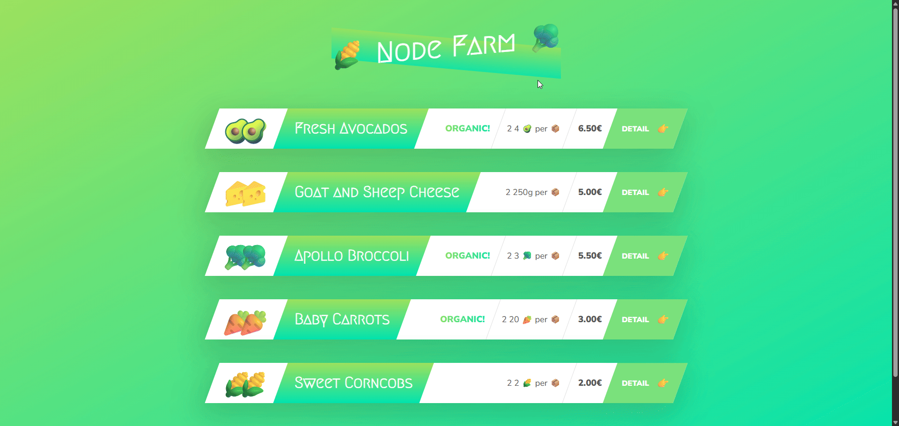

# Node Farm 🌾

A simple Node.js web application that demonstrates fundamental Node.js concepts including file system operations, HTTP server creation, routing, and templating.



## 📋 Project Overview

Node Farm is _a learning project that showcases:_

- Synchronous and asynchronous file operations
- Creating an HTTP server from scratch
- Building a simple API
- Template-based HTML rendering
- Dynamic routing and URL parameters
- ES6 modules usage

## 🚀 Features

- **Overview Page**: Displays all available products in a card-based layout
- **Product Detail Page**: Shows detailed information about individual products
- **API Endpoint**: Returns product data in JSON format
- **Dynamic Content**: Uses template replacement to generate HTML dynamically
- **Slug Generation**: Creates SEO-friendly URLs using slugify

## 📁 Project Structure

```
1-node-farm/
├── index.js                 # Main server file
├── package.json            # Project dependencies and scripts
├── dev-data/
│   └── data.json          # Product data
├── modules/
│   └── replaceTemplate.js # Template replacement utility
├── templates/
│   ├── card.html          # Product card template
│   ├── overview.html      # Overview page template
│   └── product.html       # Product detail page template
└── txt/                   # Text files for file system demos
```

## 🛠️ Installation

1. Clone the repository:

```bash
git clone https://github.com/BahaaJber1/Node-Farm.git
```

2. Navigate to the project directory:

```bash
cd 1-node-farm
```

3. Install dependencies:

```bash
npm install
```

## 🏃 Running the Application

### Development Mode (with auto-reload):

```bash
npm start
```

### Standard Mode:

```bash
node index.js
```

The server will start on `http://localhost:8000`

## 🌐 Available Routes

- `/` or `/overview` - Overview page displaying all products
- `/product?id={productId}` - Individual product detail page
- `/api` - JSON API endpoint returning all product data

## 📦 Dependencies

- **slugify** (^1.0.0): Creates URL-friendly slugs from product names
- **nodemon** (^3.1.11): Development dependency for auto-reloading

## 💡 Key Concepts Demonstrated

### File System Operations

- **Synchronous**: `fs.readFileSync()`, `fs.writeFileSync()`
- **Asynchronous**: `fs.readFile()`, `fs.writeFile()`

### HTTP Server

- Creating server with `http.createServer()`
- Handling different routes
- Setting response headers
- Serving HTML and JSON

### Template Engine

- Custom template replacement function
- Dynamic HTML generation
- Conditional rendering (organic badge)

### ES6 Modules

- Using `import/export` syntax
- Module organization and separation of concerns

## 👤 Author

**Bahaa Jber**

_This project is part of Jonas Schmedtmann's Node.js course on Udemy_
